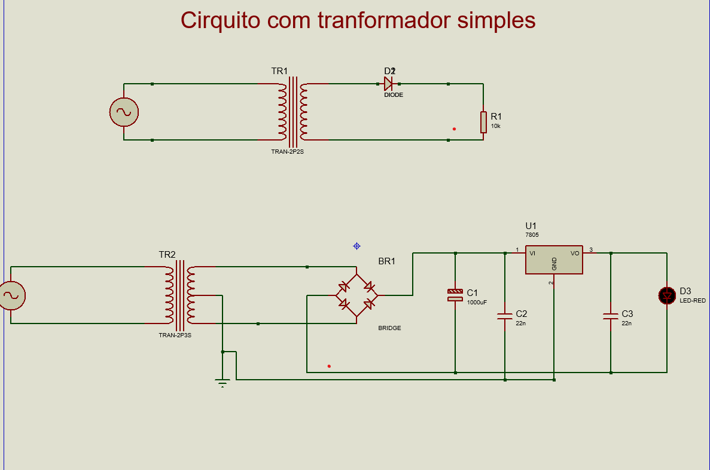
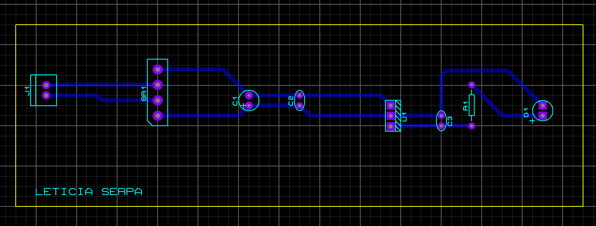
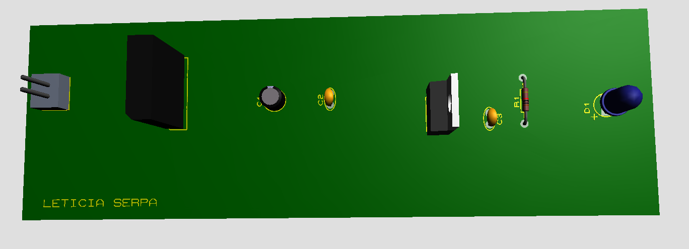
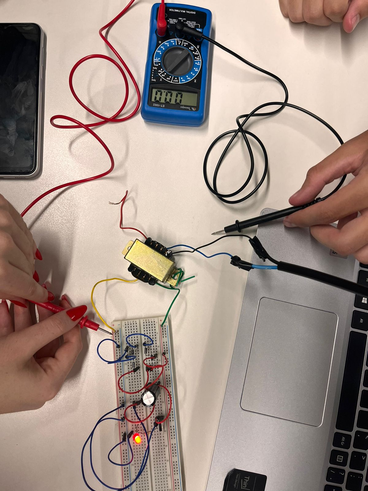
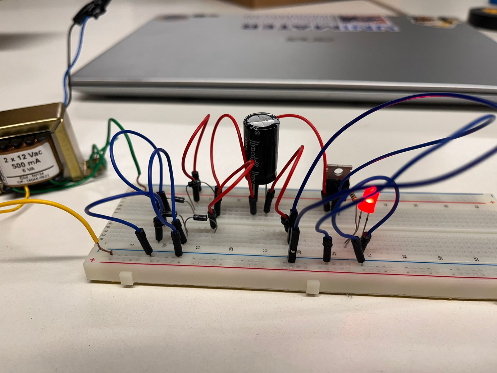

Simulador

3D

PCB

Prototipagem

Descreva o Funcionamento do Retificador 

Um retificador é um dispositivo que transforma a corrente elétrica que muda de direção (corrente alternada) em corrente elétrica que flui sempre na mesma direção (corrente contínua). É como um "conversor" de energia elétrica que muitas vezes usamos em nossos aparelhos eletrônicos para fazer com que funcionem corretamente.

